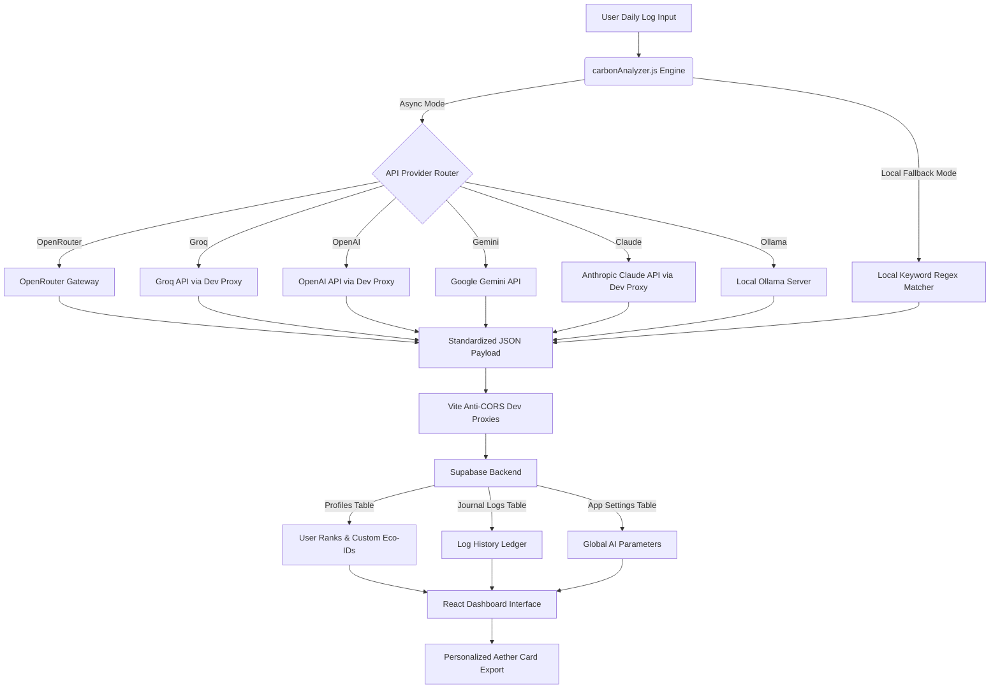

<p align="center">
  
</p>

# 🌌 Aether Carbon: Unified Sync Matrix

[](https://opensource.org/licenses/MIT)
[](https://vitejs.dev/)
[](https://react.dev/)
[](https://tailwindcss.com/)
[](https://supabase.com/)
[](https://www.framer.com/motion/)

> *"To sync with nature is to remember that we are not observers, but the ecosystem itself."*

**Aether Carbon: Unified Sync Matrix** is a premium, cinematic, eco-themed carbon footprint tracking dashboard. Designed with high-readability glassmorphism aesthetics, fluid organic animations, and a futuristic sci-fi terminal vibe, it offers users an immersive interface to log daily activities, calculate carbon impact via client-side LLMs, analyze metrics, and study climate factors.

---

## 🎨 Visual Showcase & Atmosphere

The interface is built to deliver a premium, high-fidelity user experience:

*   **Cinematic Boot Screen Overlay**: A glowing green neon leaf icon pulses while terminal status messages load, creating a dramatic gateway sequence.
*   **Organic Displacement Smoke**: Shifting green smoke bubbles warped by an SVG fractal-noise displacement filter float behind the UI, creating a bioluminescent background atmosphere.
*   **Active Leaf Particles**: 18 floating React-rendered leaves sway and fall indefinitely, utilizing randomized speeds, rotations, and delay offsets.
*   **Premium Glassmorphism**: Cards feature high-transparency glass background panels, backdrop-blur overlays, and glowing green highlights built with Tailwind CSS v4 directives.
*   **Profile Dropdown Popover**: Heavy sidebars are replaced with an interactive avatar-triggered popover menu showcasing rank, stats, avatar upload, and card exporting.
*   **Full-Width Ledger Feed**: Clean, expanded 12-column ledger feed optimized for high-readability typography.
*   **3D Tilt Cards**: Fact cards feature interactive 3D tilt effects driven by mouse coordinates and Framer Motion spring states.

---

## 🏗️ System Architecture & Data Flow



---

## 🛠️ Technology Stack

*   **Frontend Core**: [React 19](https://react.dev/) & [Vite 8](https://vite.dev/)
*   **Styling & Design System**: [Tailwind CSS v4](https://tailwindcss.com/) (native CSS integration)
*   **Animations**: [Framer Motion](https://www.framer.com/motion/)
*   **Backend & Database**: [Supabase](https://supabase.com/) (PostgreSQL Database & GoTrue Auth)
*   **Icons**: [Lucide React](https://lucide.dev/)
*   **Image Export**: [html-to-image](https://www.npmjs.com/package/html-to-image) (for generating downloadable Aether Cards)

---

## 🚀 Key Features

### 🔐 1. Custom Eco-ID Authentication
*   **Eco-ID Validation**: Accepts custom display names up to 50 characters max. Inputs containing `@` characters or matching email formats are blocked to enforce a name-only cryptographic identity.
*   **Registration Tooltip**: Features a hoverable tooltip next to the Eco-ID label indicating that the name is printed on certificates and cannot be modified later.
*   **Virtual Email Authentication**: Handles registration by translating usernames to mock email addresses (`username@gmail.com`) for password authentication, bypassing standard verification requirements.
*   **Sandbox Fallback Mode**: Works out-of-the-box using local storage fallback if Supabase is offline or environment variables are missing.

### 🧠 2. LLM Carbon Parsing Engine
*   **Multimodal API Routing**: Configurable to fetch directly from OpenAI, Claude, Groq, OpenRouter, Gemini, or a local Ollama server.
*   **Anti-CORS Development Proxies**: Features built-in Vite reverse-proxy routing for localhost dev testing against Groq, OpenAI, and Anthropic APIs.
*   **Compassionate Tone Guidelines**: Enforces a friendly, supportive tone in the LLM prompt. It avoids preachy lectures, respects user busy schedules, and guides them step-by-step.
*   **Rigorous Output Parser**: Extracts structured JSON blocks from LLM text outputs using regex wrappers, sanitizes calculations, and sets values to `null` if the user's log contains no carbon-relevant activities.

### 📊 3. 5-Day Rolling Progress Matrix
*   **Intraday Log Aggregation**: Groups and averages multiple logs submitted on the same calendar day to prevent score gaming.
*   **Sliding Active Window**: Tracks the 5 most recent active days to represent the user's progress.
*   **Rolling Mean Calculation**: Dynamically computes the average efficiency score of the 5 active days.
*   **Reactive Rank Synchronization**: User ranks are automatically updated in real-time as the 5-day rolling mean crosses threshold boundaries.

### 🎖️ 4. Dynamic Sync Rank Badges
User badges are automatically updated based on their 5-day rolling efficiency score average:
*   🔥 **Carbon Beginner** (Avg < 4.0): default yellow rank with a Flame icon.
*   🌐 **Sustainability Seeker** (Avg >= 4.0): orange rank with a Globe icon.
*   🌲 **Earth Guardian** (Avg >= 7.0): green rank with a Trees icon.
*   🏆 **Eco Vanguard** (Avg >= 9.0): blue rank with an Award icon.

### 🖼️ 5. Personalized Aether Cards
*   **Rank-Driven Themes**: Border styling, custom appreciate-texts, metallic ribbons, and background gradients automatically adapt to the user's current rank.
*   **Local Avatar Upload**: Supports persistent Base64 avatar upload from the profile dropdown menu, displaying the user photo centered inside a rank-colored glow ring on the Aether Card.
*   **Unified PNG Exports**: Uses `html-to-image` at a fixed layout dimension of `800px` by `566px`, ensuring absolute mathematical centering of the badge seal and ribbon on all screen resolutions.

---

## 💻 AI Engine & Payload Specification

When querying the active AI model, the system sends the raw daily log input along with the global system prompt. The model is instructed to return a **raw JSON object** matching the schema below:

### JSON Payload Schema
```json
{
  "calculated_kg": 4.25,
  "efficiency_score": 7.5,
  "narrative": "A concise, 3-4 sentence analysis of the activities mentioned in the text. Names each activity and explains its carbon impact.",
  "clarifying_questions": [
    "Approximate distance traveled during your car drive?"
  ],
  "causes": [
    {
      "activity": "Driving a car",
      "label": "Transportation",
      "kg": 3.8,
      "impact": "high"
    }
  ],
  "suggestions": [
    {
      "title": "Switch to Public Transit",
      "detail": "Taking the bus or train reduces transit emissions by up to 80%.",
      "steps": [
        "Step 1: Check transit schedules for your daily commute today.",
        "Step 2: Try riding the bus/train at least once this week.",
        "Step 3: Transition to transit or carpooling for regular work commutes."
      ]
    }
  ],
  "motivation": "A beautiful, encouraging sentence inspiring the user to take action."
}
```

### Fallback Mode
If the server fails to connect to the configured AI API, or if the API key is not yet set, the engine falls back to a **Synchronous Local Regex Matcher** that scans the input text for key terms (e.g. `car`, `flight`, `beef`, `ac`, `recycle`) and applies database multipliers to calculate emissions and suggest basic eco-habits.

---

## 🛠️ Admin settings & Passcode Security

The application segregates administrative configurations from regular user workflows securely:

*   **Floating Admin Portal**: Access is initiated via a small floating circular shield button in the top-right corner of the login screen, toggling a glassmorphic popover control.
*   **Credential File Verification**: Admins log in by uploading a local `admin_config.json` containing their credential variables. The file is validated and saved to `localStorage` for session persistence.
*   **Settings Passcode**: Changes to the global settings require validation of a secure passcode setup in `admin_config.json`.
*   **Active Key Verification**: Includes a **Test Key** feature that performs a mock call to the chosen provider's ping endpoint and displays a real-time status indicator.
*   **Account Settings Form**: Regular users can access an expandable settings form in the profile avatar dropdown popover. It only permits changing the account password (satisfying the 6-30 character and letter/number rule). Editing display names/Eco-IDs is disabled to preserve certificate integrity.

---

## 📁 Directory Structure

```text
unified-carbon-data/
├── .github/
│   └── workflows/
│       └── deploy.yml          # GitHub Pages CI/CD Action Workflow
├── public/
│   ├── images/                 # Carbon Fact Card Illustrations
│   │   ├── forest_canopy.png
│   │   ├── eco_transit.png
│   │   ├── green_diet.png
│   │   ├── ocean_sink.png
│   │   ├── renewable_grid.png
│   │   ├── soil_growth.png
│   │   ├── eco_hardware.png
│   │   └── climate_globe.png
│   ├── admin_config.json       # Admin credentials template
│   ├── favicon.svg
│   ├── icons.svg
│   └── leaf_background.mp4     # Ambient background video
├── src/
│   ├── components/
│   │   ├── AuthScreen.jsx      # Authentication & Eco-ID Setup
│   │   ├── Dashboard.jsx       # Carbon Dashboard, Stats & Facts Scrollable Tray
│   │   └── FallingLeaves.jsx   # Background Leaf Particle System
│   ├── utils/
│   │   └── carbonAnalyzer.js   # Client-side NLP Carbon Parsing Engine
│   ├── App.css
│   ├── App.jsx                 # App shell, Boot sequence, Smoke filters
│   ├── index.css               # Tailwind v4 directives, custom animations & typography
│   ├── main.jsx
│   └── supabaseClient.js       # Supabase Client Init
├── .env.example                # Example environment variables
├── .gitignore
├── package.json
└── vite.config.js              # Vite configuration & CORS reverse proxies
```

---

## ⚡ Getting Started

### 1. Prerequisites
Ensure you have [Node.js](https://nodejs.org/) (version 18 or 20 recommended) and `npm` installed.

### 2. Installation
Clone this repository and install the dependencies:
```bash
git clone <your-repository-url>
cd unified-carbon-data
npm install
```

### 3. Database Setup (Supabase)
Sign up for a [Supabase](https://supabase.com/) account, create a new project, and execute the following SQL script in the **SQL Editor** to initialize the database tables, RLS policies, and automatic profile triggers:

```sql
-- 1. Create Profiles Table
create table profiles (
  id uuid references auth.users on delete cascade primary key,
  display_name text not null,
  eco_id text unique not null,
  badge_status text default 'Carbon Beginner', -- 'Carbon Beginner', 'Sustainability Seeker', 'Earth Guardian', 'Eco Vanguard'
  created_at timestamp with time zone default now() not null
);

-- 2. Create Journal Logs Table
create table journal_logs (
  log_id uuid default gen_random_uuid() primary key,
  user_id uuid references auth.users on delete cascade not null,
  raw_text text not null,
  calculated_kg numeric(10, 2), -- nullable for irrelevant logs
  efficiency_score numeric(5, 2), -- nullable for irrelevant logs
  category text, -- nullable for irrelevant logs
  suggestions jsonb,
  created_at timestamp with time zone default now() not null
);

-- 3. Create Global App Settings Table
create table app_settings (
  id text primary key,
  llm_provider text not null,
  llm_api_key text,
  llm_base_url text,
  llm_model text,
  llm_system_prompt text,
  updated_at timestamp with time zone default now() not null
);

-- 4. Enable Row Level Security (RLS)
alter table profiles enable row level security;
alter table journal_logs enable row level security;
alter table app_settings enable row level security;

-- 5. Set up RLS Policies
-- Profiles Policies
create policy "Users can read all profiles" on profiles for select using (true);
create policy "Users can modify own profile" on profiles for all using (auth.uid() = id);

-- Journal Logs Policies
create policy "Users can read own logs" on journal_logs for select using (auth.uid() = user_id);
create policy "Users can insert own logs" on journal_logs for insert with check (auth.uid() = user_id);
create policy "Users can modify own logs" on journal_logs for update using (auth.uid() = user_id);
create policy "Users can delete own logs" on journal_logs for delete using (auth.uid() = user_id);

-- App Settings Policies
-- Note: Replace 'vibhath.admin@aether-carbon.com' with your configured admin email in the select policy below to lock keys securely
create policy "Allow select access to app settings for admins only" on app_settings for select using (
  auth.jwt() ->> 'email' = 'vibhath.admin@aether-carbon.com'
);
create policy "Allow modifications to app settings for authenticated users" on app_settings for all using (auth.role() = 'authenticated');

-- 6. Auto-Create Profiles Trigger
-- Resolves RLS violations when email verification is disabled
create or replace function public.handle_new_user()
returns trigger as $$
begin
  insert into public.profiles (id, display_name, eco_id, badge_status)
  values (
    new.id,
    coalesce(new.raw_user_meta_data->>'display_name', split_part(new.email, '@', 1)),
    coalesce(new.raw_user_meta_data->>'eco_id', split_part(new.email, '@', 1)),
    'Carbon Beginner'
  );
  return new;
end;
$$ language plpgsql security definer;

create or replace trigger on_auth_user_created
  after insert on auth.users
  for each row execute procedure public.handle_new_user();
```

### 4. Configuration
Create a `.env` file at the root of the project (or copy `.env.example`):
```env
VITE_SUPABASE_URL=https://your-project-id.supabase.co
VITE_SUPABASE_ANON_KEY=your-supabase-anonymous-key
```

### 5. Running Locally
Run the development server:
```bash
npm run dev
```
Open [http://localhost:5173](http://localhost:5173) in your browser to experience the application.

---

## 🚀 Deployment (GitHub Pages)

A CI/CD deployment configuration is set up at `.github/workflows/deploy.yml` to build and deploy the application to GitHub Pages on every push to the `main` branch.

### Deployment Steps:
1. In your GitHub repository, go to **Settings** -> **Secrets and variables** -> **Actions**.
2. Add the following repository secrets:
   *   `VITE_SUPABASE_URL`
   *   `VITE_SUPABASE_ANON_KEY`
3. Go to **Settings** -> **Pages** -> **Build and deployment**. Under **Source**, select **GitHub Actions**.
4. Push changes to your repository's `main` branch, and the workflow will automate the build and deploy.

---

## 🛡️ License

Distributed under the MIT License. See `LICENSE` for more details.
